# 前言

&emsp;&emsp;嵌入式开发人员一般情况下都是从C语言开始入手的，然而C语言的学习难度较大，入门门槛也比较高。很多人因为自身C语言的瓶颈导致很难做出来复杂的产品。有的人也仅仅是因为兴趣爱好只是想diy做些小玩意玩玩。如果仅仅是因为个人兴趣想去diy玩玩，而去花费大量的时间去学习C语言显然是不合算的，得不偿失。我见过很多人自身本来不从事嵌入式开发的相关工作，但是他们却用Arduino玩diy玩的风生水起，丝毫不比一些市面上所谓的商用产品差，总不能因为别人不从事相关的工作而去抹杀他们的兴趣爱好吧。我们合宙通信深知这个痛点，于是我们花费了大量的时间研发了LUAT开发，以牺牲一部分性能为代价，为用户带来更简单的开发模式，这不仅仅针对个人爱好者，面对企业客户我们的LUAT开发所能提供的功能也是绰绰有余，还能能够大大减少开发时间。

&emsp;&emsp;正所谓鱼和熊掌不可兼得，由于我们的LUAT开发是在嵌入式平台上运行一个LUAT解释器，执行效率上肯定是比不上直接用C语言开发应用的。在社区一直都有人问我们的CAT1有没有CSDK的开发方式。了解到这个情况后我们加班加点赶在五月中旬之前就开源了第一版CSDK的开发包。提供给极客们使用。客户要的我们都能满足！

&emsp;&emsp;那么现在我们就拥有了两种开发方式了。想要开发简单高效，我们提供了LUAT模式，在社区我们还提供了大量的文档教程、视频教程，让用户在极短的时间内就能掌握我们的模块的开发，大大降低了用户的学习成本。那么对于极客们如果想要榨干CPU性能的话那我们也提供了CSDK的开发方式，让你也能在某些地方比别人更快一点。

&emsp;&emsp;正常来讲的话我们的LUAT开发和CSDK开发，已经能满足绝大部分的使用需求。你以为就到此为止了吗，不！当然不仅仅这样。我们合宙通信既然选择了做开源，那么就要把开源进行到底，开源到连裤衩都不剩。做别人不敢做的，做别人不会去做的，做行业的先锋！

&emsp;&emsp;“面对友商的步步紧逼，我们的小伙伴们加班开了好几场会议，研究打法之后”，最后决定将elua解析器代码开源出来。在这里我们不仅仅是开源代码，我们还要为elua解析器配上详细的开源文档，让用户可以自己去选择裁剪哪些功能模块，添加哪些功能模块。让用户自己决定需要在底层执行那些模块，那些放到上层执行。


# 目录

[TOC]

# 第一章、Lua解析器软件架构

## 1.1、什么是lua

&emsp;&emsp;Lua是一个小巧的[脚本语言](https://baike.baidu.com/item/脚本语言)。它是巴西里约热内卢天主教大学（Pontifical Catholic University of Rio de Janeiro）里的一个由Roberto Ierusalimschy、Waldemar Celes 和 Luiz Henrique de Figueiredo三人所组成的研究小组于1993年开发的。 其设计目的是为了通过灵活嵌入应用程序中从而为应用程序提供灵活的扩展和定制功能。Lua由标准C编写而成，几乎在所有操作系统和平台上都可以编译，运行。Lua并没有提供强大的库，这是由它的定位决定的。所以Lua不适合作为开发独立应用程序的语言。Lua 有一个同时进行的JIT项目，提供在特定平台上的即时编译功能。

##  1.2、我们为什么要选择lua

&emsp;&emsp;Lua脚本可以很容易的被[C/C++](https://baike.baidu.com/item/C%2FC%2B%2B) 代码调用，也可以反过来调用C/C++的函数，这使得Lua在应用程序中可以被广泛应用。不仅仅作为扩展脚本，也可以作为普通的配置文件，代替[XML](https://baike.baidu.com/item/XML),ini等文件格式，并且更容易理解和维护。  Lua由标准C编写而成，代码简洁优美，几乎在所有操作系统和平台上都可以[编译](https://baike.baidu.com/item/编译/1258343)，运行。一个完整的Lua解释器不过200k，在所有[脚本引擎](https://baike.baidu.com/item/脚本引擎/4449478)中，Lua的速度是最快的。这一切都决定了Lua是作为嵌入式脚本的最佳选择。

&emsp;&emsp;就是因为lua解释器的代码足够小，在所有的脚本引擎中是运行最快的，我们才选择lua作为切入点，绝不是因为头难一热乱选了一个。


## 1.3、lua解析器架构

&emsp;&emsp;Lua语言的架构图如下图所示，大家可以看看软件架构，主要是通过全局状态机完成各个模块的调用，这里不做深入讲解，有兴趣的可以自行阅读[lua源码](http://www.lua.org/)。

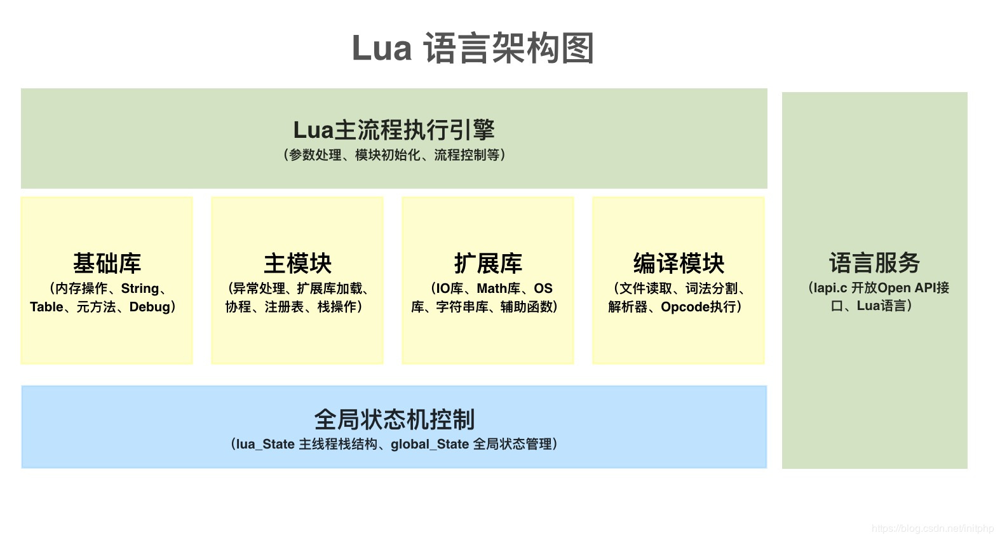

## 1.4、嵌入式平台的lua实现

&emsp;&emsp;我们的elua开源项目是基于Lua5.1之上进行开发的，将其进行了相应的基础库功能裁剪，并且添加了一些用于硬件驱动的库，使其在具备必要的硬件驱动的基础上占用的资源更少，更加适合运行在嵌入式平台上。

# 第二章、elua开源模块

&emsp;&emsp;在第一章中我们学习了下lua是什么、为什么要选择lua、lua解析器架构以及elua的设计思路。这些基本上都是一些概念和设计理念，可以说是作为本文档的一个绪论。带着大家走进elua的大门。

&emsp;&emsp;这里只讲概念显然是没有什么太大的用处的，那么本章我们就来点实际的东西，一起看一下elua的代码。


&emsp;&emsp;我们的elua开源模块主要由五大部分组成，他们分别是：newlib、lua、modules、lib、platfom。他们对应的功能如下表所示。

| newlib        | lua        | modules      | lib | platfom      |
| ---------- | ---------- | ------------ | ------- | ------------ |
| c库代码 | 解析器代码 | 功能模块 | 功能库代码 | 平台适配代码 |

* c库代码：主要是一些c标准库
* 解析器代码：lua内核
* 功能库代码：提供一些软件算法
* 功能模块：硬件驱动模块，和抽象层对接
* 平台适配代码：是elua的抽象层，与外界代码打交道

&emsp;&emsp;上面所述的五大模块功能各不相同，他们共同组成了我们的elua开源项目，每个大模块内又会细分为几个小模块，一层套一层。各个模块之间又有千丝万缕联系，并不是互相独立的。本开源项目的文件数量达到了656个，仅仅是纯代码就占用了50M的存储空间。随着后续开源文档的进行，我们会拿出几个小节来手把手教大家添加其他的功能模块，让我们自己写的代码也能让lua解释器调用。到那时这个文件数量还会进一步增加。


&emsp;&emsp;现阶段我们的elua开源模块的总目录结构如下图所示。里面仅仅是列出了部分重要的具有代表意义的功能以及文件。从这张图我们也能看出来elua开源项目默认就支持了那些功能。

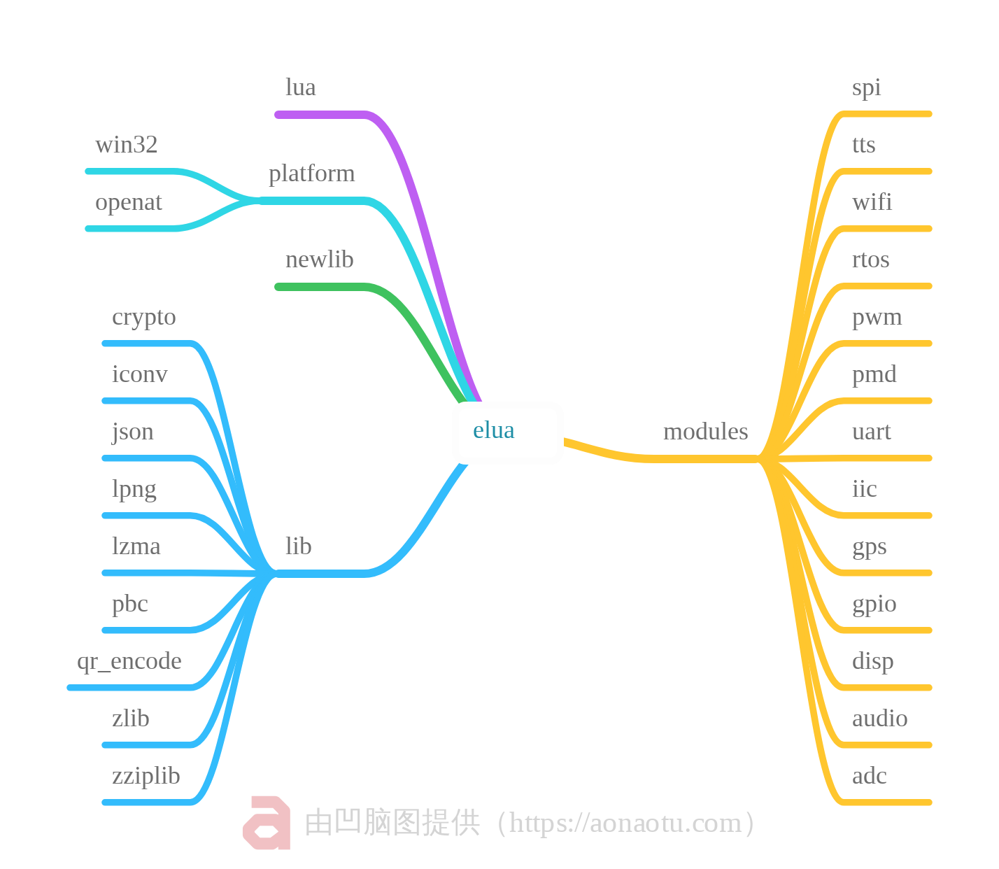


## 2.1、C库代码

&emsp;&emsp;由于某些原因我们的elua开源项目中不能采用标准的c库函数，而是内置了一套专用的c库代码，这套c库代码与标准c库的命名保持一致。不过其内部的实现却发生了很大的变化。

&emsp;&emsp;有的同学在学习STM32的时候，可能会遇到一个问题那就是串口通信printf重定向。st官方并没有提供printf函数给我们用，这时候如果想要使用printf向串口打印日志的话那就需要对printf进行重定向。

&emsp;&emsp;在标准的c库函数中printf是向控制台打印输出信息。而在嵌入式平台上，是没有控制台的。如果想要用printf函数的话那就只有两个办法。

&emsp;&emsp;第一就是大家在使用stm32时用到的方法，对printf函数进行输出重定向。那么这个办法在裸机编程上倒是看不出来什么弊端。大家在使用操作系统编程比如freertos这些就会发现一个问题。如果任务的堆栈空间分配比较小，同时又在任务中使用到了printf打印数据那么就会出现堆栈溢出导致程序崩溃。这是因为printf函数使用时会在栈空间定义一个大缓冲区存储数据，这个缓冲区只是临时定义的，用完就会被析构掉。在使用printf时临时缓冲区会被算到任务堆栈大小中，只要给任务分配到空间小了，那么就会导致程序堆栈空间溢出程序崩溃。按照我以前踩坑的经验，即使你只是点个灯，只要用到了printf函数，如果此时任务的堆栈空间小于2048程序就会崩溃。这样就不太好了是吧，起步2048哪有这么多内存去搞。


&emsp;&emsp;为了解决这个问题，那么我们就需要用到第二个方法，那就是我们即将要讲到的重写c标准库，把它里面的空间缩小，改变实现的方法。

&emsp;&emsp;C库代码这一小节对应的是我们的elua开源项目中的newlib文件夹里面的内容，里面工作是将标准的C库函数重新实现了一下。主要就是一些我们经常使用到的这些，比如`#include"string.h"`、`#include"stdio.h"`、`#include"stdlib.h"`、`#include"malloc.h"`、`#include"math.h"`。还有一些用的比较少，但是elua解析器里面会用到的，这里就不讲了。


&emsp;&emsp;newlib文件夹的结构如下图所示，涉及到的文件数量也是一大把。有兴趣的自己去看。

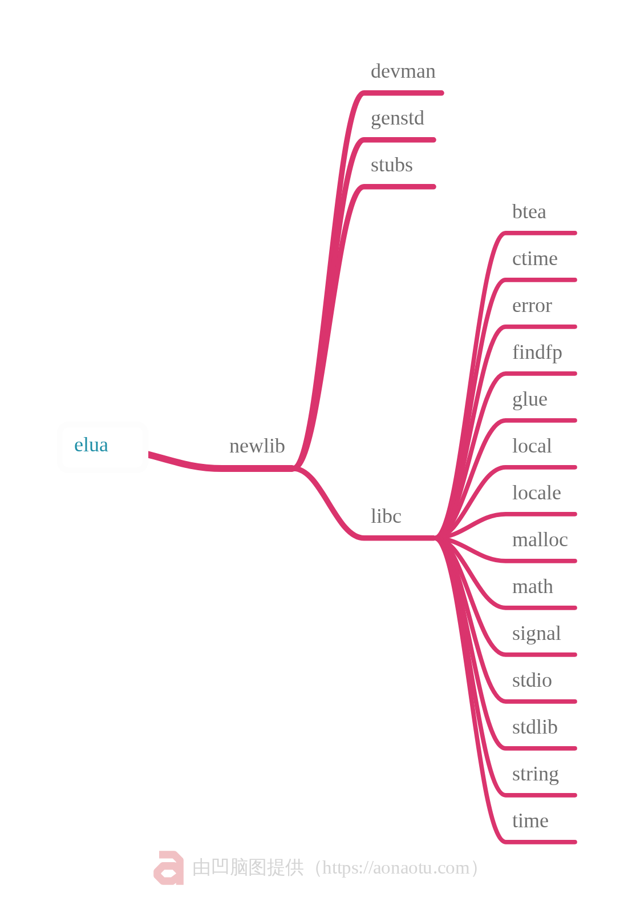

&emsp;&emsp;有的函数需要和硬件平台打交道，不能直接用标准库。比如stdio库中的一些函数，就拿`fopen_ext"`函数来看一下，它里面的实现用到了一些和平台相关的代码。

```c
char *fgets_ext(char *buf, int n, FILE *fp);
FILE *fopen_ext(const char *file, const char *mode);
int fclose_ext(FILE *fp);
int getc_ext(FILE *fp);
int ungetc_ext(int c, FILE *fp);
size_t fread_ext(void *buf, size_t size, size_t count, FILE *fp);
int fseek_ext(FILE *fp, long offset, int whence);
long ftell_ext(FILE *fp);
int feof_ext(FILE *fp);
```

```c
FILE *fopen_ext(const char *file, const char *mode)
{
    FILE *fp = NULL;
    E_LUA_SCRIPT_TABLE_SECTION section = LUA_SCRIPT_TABLE_MAX_SECTION;
    T_UNCOMPRESS_FILE_TABLE_ITEM *pItem = NULL;
    int fileNameLen = strlen(file);
    
    if((!file) || (strlen(file) == 0))
    {
        OPENAT_print("[fopen_ext]: para error!\n");
        return fp;
    }

    if(FindUncompressFileItem(&section, &pItem, file))
    {        
        fp = L_CALLOC(1,sizeof(FILE));
        if(fp)
        {
            fp->_flags = section;
            fp->_cookie = pItem;
        }
        fp->_type = LUA_UNCOMPRESS_FILE;

    #ifdef AM_LUA_CRYPTO_SUPPORT
        if(strncmp(&file[fileNameLen - 5],".luac", 5) == 0)
        {
            fp->_type |= ENC_FILE;
        }
    #endif

        //printf("[fopen_ext]: %s %d!\n", file, fp->_type);

    }

    return fp;
}
```

&emsp;&emsp;当然这其中个例不能说明一切，那我们就再来看一个函数`_malloc_r`。


```c
void* _malloc_r( size_t size )
{
#ifdef MUXUSE_DLMALLOC_MEMORY_AS_LUA_SCRIPT_LOAD
    if(bScriptLoaded)
    {
        return dlmalloc(size);
    }
    else
#endif
    {
        return CNAME( malloc )( size );
    }
```

&emsp;&emsp;这个`_malloc_r`经过if判断调用的是`CNAME( malloc )( size )`，而`CNAME( malloc )( size )`最终又指向`platform_malloc`这是我们的elua抽象层的代码，最终它调用的是函数是需要和硬件打交道的，直接采用标准版的c库肯定是不适用的。

```c
void* platform_malloc( size_t size )
{
    return OPENAT_malloc( size );
}
```

&emsp;&emsp;这个其实也算是一个抽象层，只不过它抽象的是标准库函数。使elua解析器能够在嵌入式平台上面正常运行。

&emsp;&emsp;有人可能会讲，那我用其他的开发平台怎么能直接用malloc函数、printf函数，这些标准函数直接用也没有什么问题啊，哪有这么多事情。这里我提醒一下，那是因为开发包底层已经把这部分代码处理好了，有可能是重写，也有可能是重定向。对于用户什么来讲都不用管，直接用。但是这个底层绝对不是直接使用的c库的标准代码的。

&emsp;&emsp;各位同学不信的话可以打开我们的`iot_sdk_4g_8910`开发包看下`components`文件夹下是不是也有一个`newlib`文件夹。

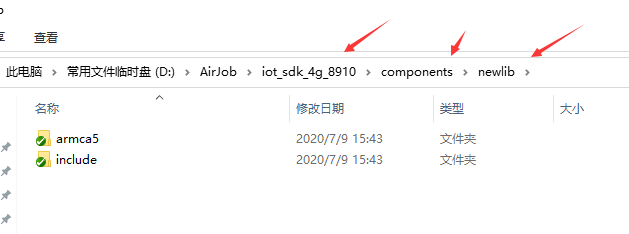


&emsp;&emsp;那我们可能又有一个疑问，既然elua开源项目是运行在`iot_sdk_4g_8910`上面的，为什么不直接用`iot_sdk_4g_8910`的newlib呢。这里那就说一下，既然我们做开源，那就说明这个elua软件包不仅仅是只能用在`iot_sdk_4g_8910`上面的，只要各位有能力那就可以把它运行在任何平台上。那就拿stm32来讲，他就没有给用户提供这些c标准库（现在我也不清楚有没有提供，至少几年前是没有的）。它都没有，那用户移植起来岂不是很复杂，甚至有可能移植不成功。

## 2.2、lua解析器代码

&emsp;&emsp;在上一节我们讲到了C标准库的重新实现。只要讲到了为什么要重新实现C标准库，既然csdk开发包中既然已经存在了newlib为什么还要在elua软件包中还要重新再写一遍这两个问题。

&emsp;&emsp;那么费这么大劲搞着玩意，那么这个C标准库到底是给谁用的呢？

&emsp;&emsp;它的使用对象，那自然是elua解析器了，那么本小节我们就一起来捋一遍lua解析器的代码。

&emsp;&emsp;lua解析器位于`elua/lua`文件夹下，其代码结构如下图所示。

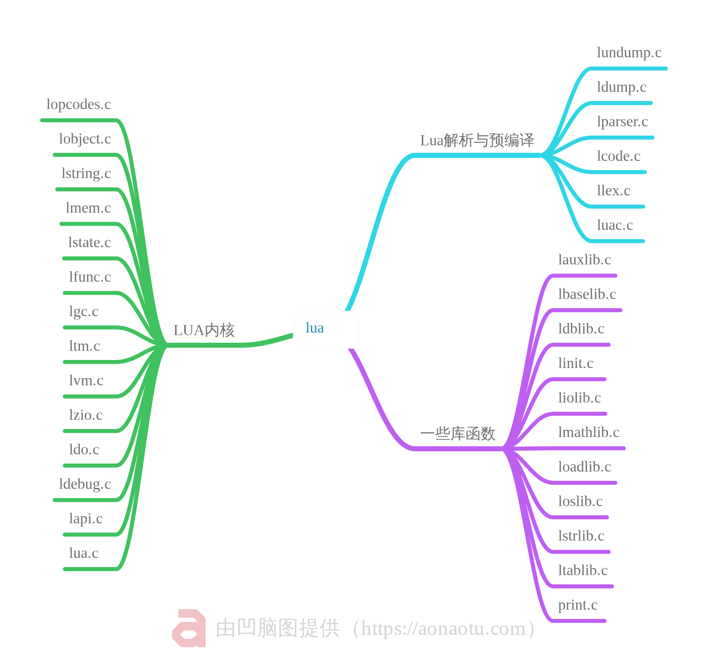

&emsp;&emsp;lua解析器代码我这里将其分为三个大块，它们分别是虚拟机核心功能部分、源代码解析和预编译部分以及内嵌库部分。

注意：这是我个人对它源码的结构进行的划分，目的是方便理解，不是官方的定义，官方有没有这个结构的划分我也不清楚。

### 2.2.1、Lua内核

&emsp;&emsp;lua内核顾名思义那就是lua的核心代码，负责的是lua虚拟机的运行、调度、内存管理、输入输出设备监视以及全局状态机的管理等功能。这些都是最基本的功能，虚拟机能够运行起来靠的就是内核在后面起作用。没有内核你搞那些乱七八招的东西没有意义。

&emsp;&emsp;lua内核中的各个文件具体是干什么的，在下表也有说明。

| 源文件     | 功能                                |
| ---------- | ----------------------------------- |
| lvm.c      | Lua虚拟机                           |
| ltm.c      | 元方法                              |
| ldebug.c   | 调试接口                            |
| lzio.c     | 通用输入流接口                      |
| lstate.c   | 全局状态机 管理全局信息             |
| ldo.c      | Lua的堆栈和调用结构                 |
| lfunc.c    | 函数原型及闭包管理                  |
| lobject.c  | 对象操作函数                        |
| lgc.c      | 垃圾回收机制                        |
| lapi.c     | Lua API                             |
| lmem.c     | 内存管理接口                        |
| lopcodes.c | 虚拟机字节码定义                    |
| lua.c      | lua的可执行入口 main函数            |
| lstring.c  | 字符串表（保留Lua处理的所有字符串） |
| ltable.c   | Lua表（哈希）                       |

### 2.2.2、Lua解析和预编译

&emsp;&emsp;Lua语言是一个解释性语言，它不是直接就能运行的。运行时需要将文件系统中的lua文件读取出来，然后需要将lua语句翻译成对应的c指令才能运行。那么这个解析功能就需要一个单独的模块来负责，它由内核控制主要负责lua脚本的词法分析、解析、编译等这些功能。

| 源文件    | 功能              |
| --------- | ----------------- |
| lparser.c | Lua的解析器       |
| luac.c    | Lua编译器（将字节码保存到文件；也列出字节码）            |
| ldump.c   | 保存预编译的Lua块 |
| lundump.c | 加载预编译的Lua块 |
| llex.c    | Lua的词法分析器   |
| lcode.c   | Lua的代码生成器   |

### 2.2.3、一些库函数

&emsp;&emsp;除了让lua虚拟机能够运行起来，还要给它内置一写操作库函数。让它用起来更方便、更简单。要有化繁为简的本领，让用户使用起来更不易出错，这也是脚本语言的特色。

&emsp;&emsp;下表中列出了lua解析器内部一些内置库的实现文件，主要是基础库、数学运算库、操作系统库、table库以及调试库。


| 源文件     | 功能                             |
| ---------- | -------------------------------- |
| loadlib.c  | Lua的动态库加载器                |
| liolib.c   | 标准I /O（和系统）库             |
| loslib.c   | 标准操作系统库（这应该是协程）                   |
| lauxlib.c  | 用于构建Lua库的辅助功能          |
| linit.c    | 初始化lua.c的库                  |
| ltablib.c  | 用于表操作的库                   |
| ldblib.c   | 从Lua到其调试API的接口           |
| lmathlib.c | 标准数学运算库                   |
| lbaselib.c | 基础库                           |
| lstrlib.c  | 用于字符串操作和模式匹配的标准库 |
| print.c  | 打印字节码 |

## 2.3、硬件功能模块

&emsp;&emsp;上一节我们简单介绍了下lua解析器的代码结构，lua解析器默认自带了一些基础的运算库、操作库，只能实现很简单的功能。那么到现在为止lua脚本简单的运行起来应该是没有什么问题了，但是这个运行的结果我们却没办法看到，因为它里面还没有写任何和硬件打交道的代码。即使是一个简单的串口打印helloworld它也需要使用到串口这个硬件驱动。

&emsp;&emsp;那其他的硬件那就更不必说，都是需要人为加进去的，lua解析器自身并不带这些功能。在`elua/modules`文件夹内，我们也集成了一部分常用的硬件驱动。


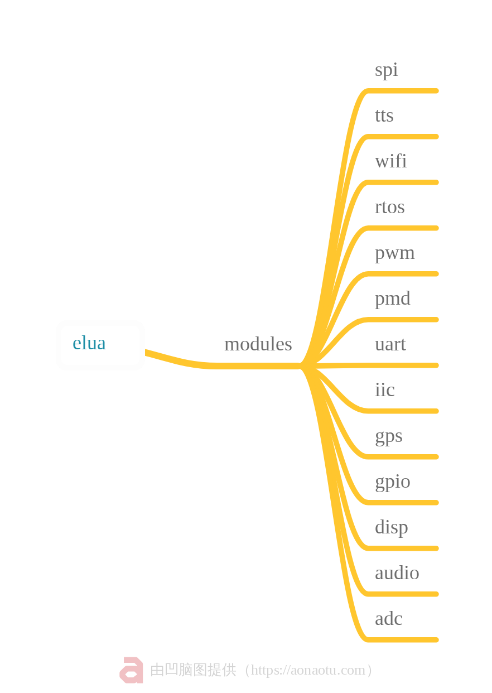

&emsp;&emsp;上图中只是列出了一部分常用的驱动库，实际的modules文件夹下的的库文件有很多。接下来拿出adc库进行相应的说明，怎么才能把adc的驱动代码注册到lua虚拟机中。让用户能够在lua脚本中进行adc的采集控制。

### 2.3.1、注册adc

&emsp;&emsp;用户如果想要让lua内核能够调用adc的相关库，首先需要在`auxmods.h`中声明模块名字和adc模块初始化函数。

```c
#define AUXLIB_ADC      "adc"
LUALIB_API int ( luaopen_adc )( lua_State *L );
```

&emsp;&emsp;声明之后需要在`platform_conf.h`文件中完成将模块名和初始化函数注册到lua内核中。

```c
    _ROM( AUXLIB_ADC, luaopen_adc, adc_map )
```

&emsp;&emsp;adc模块注册之后，相当于我们只是告诉了lua内核我们提供了adc的相关驱动，但是这个驱动内有什么函数可以调用lua内核却不知道。这时候我们还需要另外在lua模块内完成adc驱动的相关调用函数的注册。

&emsp;&emsp;下面的代码中我们为adc模块注册了三个可用lua脚本调用的函数，分别是`open`、`read`、`close`。这三条lua函数对应的c语言中的实现函数分别是`adc_open()`，`adc_read()`，`adc_close()`。

```c
const LUA_REG_TYPE adc_map[] =
{ 
  { LSTRKEY( "open" ),  LFUNCVAL( adc_open ) },
  { LSTRKEY( "read" ),  LFUNCVAL( adc_read ) },
  { LSTRKEY( "close" ),  LFUNCVAL( adc_close ) },

  { LNILKEY, LNILVAL }
};

LUALIB_API int luaopen_adc( lua_State *L )
{
    luaL_register( L, AUXLIB_ADC, adc_map );

    return 1;
}  
```

&emsp;&emsp;那这样写为什么就能被lua脚本调用呢，之间又有什么关系。下面我把这三条脚本换个写法，`open`、`read`、`close`三个函数对应的lua调用脚本是`adc.open()`、`adc.read()`、`adc.close()`，这样看起来是不是有点似曾相识的感觉。但一时半会好像又想不起来在哪见过，给你们五秒钟时间想，给我使劲想！！！


&emsp;&emsp;对，没错！如果各位同学之前使用过我们模块的adc采集功能，我猜各位应该已经想到了在luat脚本的adc例程中，有这么一段。

```lua
local function ADC0_Task()
    local adcValue, voltValue = 0, 0
    local result = adc.open(0)----------1、这一行是不是很眼熟
    while true do
        adcValue, voltValue = adc.read(0)----------2、这一行好像也有点眼熟
        if adcValue ~= 0xffff then
            log.info("ADC 0的原始测量数据和电压值:", adcValue, voltValue)
        end
        sys.wait(1000)
    end
    adc.close(0)----------3、看到这一行的话，应该就没有什么疑问了吧
end
```

&emsp;&emsp;上面的Luat脚本中看起来有很多东西，实际上和adc有关的就用到了三行，而这三行正好就是我们的adc注册函数中注册的三条语句。我们底层中只要把这三条注册的语句写出来了，就算这三个函数的里面没有任何实现（函数还是要写的哈），是一个空函数。你也能写lua脚本给lua底层去解析，lua底层就能找到这个函数的位置然后去执行。你可以在这个函数内写很多功能，做非常复杂的事。这对于lua脚本而言，就只需要一行。

### 2.3.2、adc调用函数的实现

&emsp;&emsp;虽然现在我们所做的工作已经能够让lua内核来运行我们的自定义模块了，当然这个模块现在还是空的，啥也没有。lua解析器跑到这里转一圈又回去了，什么事情都没干。

```c
// adc.open(id)
static int adc_open(lua_State *L) {
    return 1; 
}

// adc.read(id)
static int adc_read(lua_State *L) {    
    return 2; 
}

static int adc_close(lua_State *L) {
    return 1; 
}
```

&emsp;&emsp;我们还需要按照特定的规则，完成调用函数内部具体的实现方法。来大家注意看了哈，我变。


&emsp;&emsp;咳咳，变出来了。

```c
// adc.open(id)
static int adc_open(lua_State *L) {
    int id = luaL_checkinteger(L, 1);
    int ret;

    MOD_CHECK_ID(adc, id);

    ret = platform_adc_open(id,0);

    lua_pushinteger(L, ret);

    return 1; 
}

// adc.read(id)
static int adc_read(lua_State *L) {    
    int id = luaL_checkinteger(L,1);
    int adc, volt;

    MOD_CHECK_ID(adc, id);

    platform_adc_read(id, &adc, &volt);

    lua_pushinteger(L, adc);
    lua_pushinteger(L, volt);
   
    return 2; 
}

static int adc_close(lua_State *L) {
    int id = luaL_checkinteger(L, 1);
    int ret;

    MOD_CHECK_ID(adc, id);

    ret = platform_adc_close(id);

    lua_pushinteger(L, ret);

    return 1; 
}
```

### 2.3.3、几个无关紧要的函数

&emsp;&emsp;上面的三个代码块中我们分别为adc的打开，查询和关闭功能进行了相应的实现。我们可以找一下规律。上面三个函数的实现结构很相似，可以用下面的伪代码表示。

```c
// adc.open(id)
static int adc_open(lua_State *L) {
    int id = luaL_checkinteger(L, 1);
    MOD_CHECK_ID(adc, id);
   	/*用户代码*/
    ...........
    /*用户代码*/
    lua_pushinteger(L, ret1);
    lua_pushinteger(L, ret2);
    lua_pushinteger(L, ret3);
    return 1; 
}
```

&emsp;&emsp;`luaL_checkinteger`作用是检查函数的第 arg 个参数是否是一个字符串，并返回该字符串。

&emsp;&emsp;`MOD_CHECK_ID`是一个宏，对应的代码如下，目的是判断传入的操作数是不是允许的允许的。打个比方，我们的设备假如只有两个adc，那我们可操作的adc编号就是0和1，你给我来个2，那程序就终止运行了并且打印`adc 2 does not exist`。

```c
// Helper macros
#define MOD_CHECK_ID( mod, id )\
  if( !platform_ ## mod ## _exists( id ) )\
    return luaL_error( L, #mod" %d does not exist", ( unsigned )id )
```

&emsp;&emsp;在lua的语法中允许函数一次返回多个值，`lua_pushinteger`作用就是返回lua的运行结果的。

&emsp;&emsp;在上面说到的lua脚本中的读取adc这一句。等号左边的两个返回值。就是由c代码中的两句`lua_pushinteger`代码推送的。

```lua
 adcValue, voltValue = adc.read(0)
```
```c
    lua_pushinteger(L, adc);
    lua_pushinteger(L, volt);
```
## 2.4、功能库代码

&emsp;&emsp;经过上一节的学习，大家应该也都清楚了怎么才能去添加一些驱动库。一般情况下2.3小节提供的驱动库也够用了。有时候我们不仅仅是驱动设备，还需要运行一些软件算法，比如sha1、md5这些信息摘要算法，还有一些图片的解码算法。json数据处理等等。

&emsp;&emsp;这些算法都是比较常见的，也经常会使用到。我们也在elua代码包中内置了一些纯软算法，具体见下图。

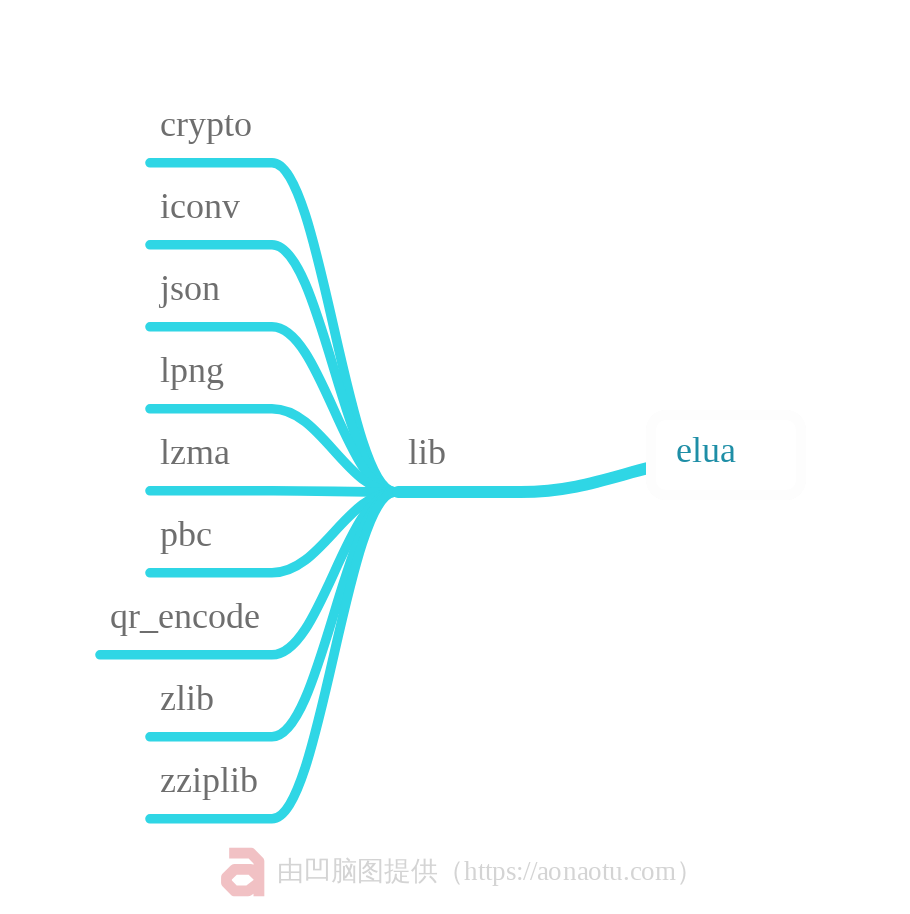

&emsp;&emsp;上面图片中的命名有的人可能不知道这些库有什么作用，这里做一下简要说明。

| 代码包    | 功能                                                 |
| --------- | ---------------------------------------------------- |
| crypto    | 加密/摘要功能（sha1、sha2、md5、base64、xxtea、aes） |
| iconv     | 字体编码转化(gb2312、ucs2、utf8、)                   |
| json      | 把*JSON*内容或*JSON*文件进行格式化解析               |
| lpng      | 图片解码                                             |
| lzma      | 压缩文件接口                                         |
| pbc       | 基于双线性对的密码学库                               |
| qr_encode | 二维码生成                                           |
| zlib      | 通用的压缩库                                         |
| zziplib   | 轻量级的用来从ZIP文件抽读取文件的C语言包             |


&emsp;&emsp;还是和上节一样，库太多了，这些库里面又有一大堆文件。本来准备选个高大上的库讲讲，就是那个啥----基于双线性对的密码学库。这时候没想到json这么积极，举手要求上台，那我就勉为其难的答应她好了。接下来我们讲讲json，举一反三都一样哈。


### 2.4.1、json注册

&emsp;&emsp;和硬件驱动一样，即使json是纯软运算库也没有什么特殊的地方，该有的东西都得有。

&emsp;&emsp;如果想json能在lua脚本中被调用，首先那就必须得在`auxmods.h`中增加声明json模块的模块名和注册函数。

```c
#ifndef AM_JSON_NOT_SUPPORT
#define AUXLIB_JSON     "json"
LUALIB_API int ( luaopen_cjson)( lua_State *L );
#endif
```

&emsp;&emsp;声明之后需要在`platform_conf.h`文件中完成将模块名和初始化函数注册到lua内核中。

```c
_ROM( AUXLIB_JSON, luaopen_cjson, json_map )
```

&emsp;&emsp;紧接着就在模块初始化函数函数内进行模块函数注册。这一段json库的函数注册代码就要比adc库的函数注册代码要复杂得多。

```c
/* Return cjson module table */
static int lua_cjson_new(lua_State *l)
{
    luaL_Reg reg[] = {
        { "encode", json_encode },
        { "decode", json_decode },
        { "encode_sparse_array", json_cfg_encode_sparse_array },
        { "encode_max_depth", json_cfg_encode_max_depth },
        { "decode_max_depth", json_cfg_decode_max_depth },
        { "encode_number_precision", json_cfg_encode_number_precision },
        { "encode_keep_buffer", json_cfg_encode_keep_buffer },
        { "encode_invalid_numbers", json_cfg_encode_invalid_numbers },
        { "decode_invalid_numbers", json_cfg_decode_invalid_numbers },
        { "new", lua_cjson_new },
        { NULL, NULL }
    };

    /* Initialise number conversions */
    fpconv_init();

    /* cjson module table */
    lua_newtable(l);

    /* Register functions with config data as upvalue */
    json_create_config(l);
    luaL_setfuncs(l, reg, 1);

    /* Set cjson.null */
    lua_pushlightuserdata(l, NULL);
    lua_setfield(l, -2, "null");

    /* Set module name / version fields */
    lua_pushliteral(l, CJSON_MODNAME);
    lua_setfield(l, -2, "_NAME");
    lua_pushliteral(l, CJSON_VERSION);
    lua_setfield(l, -2, "_VERSION");

    return 1;
}
int luaopen_cjson(lua_State *l)
{
    lua_cjson_new(l);

#ifdef ENABLE_CJSON_GLOBAL
    /* Register a global "cjson" table. */
    lua_pushvalue(l, -1);
    lua_setglobal(l, CJSON_MODNAME);
#endif

    /* Return cjson table */
    return 1;
}
```

### 2.4.2、json调用函数的实现

&emsp;&emsp;纯软模块和硬件驱动不同的地方现在开始体现出来了。像json这一类纯软模块不依赖外部环境，实现用的都是一些标准库。基本上就是拿来就能用，都不需要改的。如果json模块只是给elua用，不考虑提供给外界使用的话。那我们就可以直接在上述lua调用的实现中直接去调用json库中的函数。而无需去单独在抽象一层。

&emsp;&emsp;看这个adc模块中的adc_open函数实现，去掉一些必须得写的，实际上和adc有关的就一行。这一行platform开头的代码就是我们下一章节要讲的平台适配代码。它可以看作是elua开源项目的一个特殊的抽象层，负责和外界的环境进行交互，这里不做细讲，了解即可。

```c
// adc.open(id)
static int adc_open(lua_State *L) {
    int id = luaL_checkinteger(L, 1);
    int ret;

    MOD_CHECK_ID(adc, id);

    ret = platform_adc_open(id,0);

    lua_pushinteger(L, ret);

    return 1; 
}
```

&emsp;&emsp;再来看看json模块中的json_decode函数的实现，这就不一样了是吧，这么一大坨看着都晕。这还是我挑选的一个比较简单的，其他的那就更长了。

```c
static int json_decode(lua_State *l)
{
    json_parse_t json;
    json_token_t token;
    size_t json_len;

    luaL_argcheck(l, lua_gettop(l) == 1, 1, "expected 1 argument");

    json.cfg = json_fetch_config(l);
    json.data = luaL_checklstring(l, 1, &json_len);
    json.current_depth = 0;
    json.ptr = json.data;

    /* Detect Unicode other than UTF-8 (see RFC 4627, Sec 3)
     *
     * CJSON can support any simple data type, hence only the first
     * character is guaranteed to be ASCII (at worst: '"'). This is
     * still enough to detect whether the wrong encoding is in use. */
    if (json_len >= 2 && (!json.data[0] || !json.data[1]))
        luaL_error(l, "JSON parser does not support UTF-16 or UTF-32");

    /* Ensure the temporary buffer can hold the entire string.
     * This means we no longer need to do length checks since the decoded
     * string must be smaller than the entire json string */
    json.tmp = strbuf_new(json_len);

    json_next_token(&json, &token);
    json_process_value(l, &json, &token);

    /* Ensure there is no more input left */
    json_next_token(&json, &token);

    if (token.type != T_END)
        json_throw_parse_error(l, &json, "the end", &token);

    strbuf_free(json.tmp);

    return 1;
}
```

&emsp;&emsp;给大家20秒扫一眼，看看上面的代码有没有`platform`开头的函数。


&emsp;&emsp;哎，好像没有是吧！这就说明这个json模块是给elua开源项目特供的，不需要给外界使用。也不需要把它拎到项目外面，再另外做一个抽象层与elua对接。


## 2.5、平台适配代码

&emsp;&emsp;上面两节讲到了硬件驱动的注册和软件算法的注册，软件算法可以选择独占还是共有。其中硬件驱动在lua函数中的实现需要通过一个抽象层完成与外部的对接。软件算法如果选择独占那可以直接在lua函数实现进行调用，如果选择共享那它也得和硬件驱动一样另外做一个抽象层与外部进行对接。

&emsp;&emsp;那么大家有没有想过↓↓↓↓↓↓↓↓↓↓↓↓↓↓

### 2.5.1、为什么要有平台适配代码

&emsp;&emsp;一个成功的软件系统，往往需要根据需求在不同的系统平台上运行，为了解决系统在多个平台的移植带来的风险，业务架构往往会设计相应的平台适配层来隔离不同平台的差异，如何设计一个易于扩展的平台适配层，是软件设计人员需要考虑的问题。

&emsp;&emsp;为了让大家更方便地移植我们的elua开源模块，我们进行了相应的平台适配代码的编写工作，其目录位于elua/platform。我们由于时间有限，在该目录下只提供了opanat平台的适配代码以及win32平台的适配代码。其中openat平台的适配代码支持的功能较多，可以直接用于我们的csdk开发环境，该提供的功能基本都提供了。若有其他需求，也可自行添加其他的程序模块。


### 2.5.2、平台适配代码adc与openat对接

&emsp;&emsp;拿上面硬件驱动中的adc模块讲下，它的平台适配代码极其简单，看看下面的代码块其中`platform_adc_open`的对接只需要一行。`platform_adc_close`的对接还是一行。
`platform_adc_read`的对接看起来有好几行，仔细看看读取部分，实际上还是只有一行，只不过为了给elua提供两个结果的返回值，进行了一点点运算。

```c
int platform_adc_open(unsigned id, unsigned mode)
{
    //return PLATFORM_OK;
    /*+\BUG\wangyuan\2020.06.30\lua版本编译不过*/
    return IVTBL(InitADC)(id, mode) ? PLATFORM_OK : PLATFORM_ERR;
    /*-\BUG\wangyuan\2020.06.30\lua版本编译不过*/
}

int platform_adc_close(unsigned id)
{
    return IVTBL(CloseADC)(id) ? PLATFORM_OK : PLATFORM_ERR;
}

int platform_adc_read(unsigned id, int *adc, int *volt)
{
    u16 adcVal = 0xFFFF;
    u16 voltage = 0xffff;
    BOOL ret;

    ret = IVTBL(ReadADC)(id, &adcVal, &voltage);

    *adc = voltage / 3;
    *volt = voltage;
    return ret ? PLATFORM_OK : PLATFORM_ERR;
}
```

&emsp;&emsp;那么到现在为止，我们已经将elua的内核部分、模块的注册部分、平台的对接部分，都捋了一遍。东西就这么多，流程就是这样。只不过有的模块复杂点，有的地方的代码它就多一点，化繁为简就那么几行重要的。那么我们的elua开源项目的基础部分也就到处为止了。说那么多有什么用，你甚至可以不看，是骡子是马拉出来溜溜。


# 第三章、Lua解析器代码编译

&emsp;&emsp;第二章我们讲了下lua内核和模块注册示例，那么第三章那我们就把它拿出来跑跑。

&emsp;&emsp;有的同学会讲，我这第二章也没怎么看懂啊，第三章还能继续学吗，要是不行的话那我就溜了，删库跑路走起。


&emsp;&emsp;少年不要怕，我以人格担保。这第二章别说你没看懂，就算你没看。第三章你也能跑起来，你也能学会。So ,Believe in Yourself !!!


## 3.1、CSDK分区相关知识

&emsp;&emsp;接下来的内容就和设备密切相关，在进入代码编译之前，我们需要知道一些基本的分区信息。我们这里以rda8910平台为例。


### 3.1.1、默认CSDK分区


| rda8910（8M） | app预留空间 | 文件系统空间 |
| ------------- | ----------- | ------------ |
| 起始地址      | 0x60160000  | 0x60340000   |
| 长度          | 0x1E0000    | 0x160000     |
| 结束地址      | 0x60340000  | 0x604a0000   |

&emsp;&emsp;正常的csdk底层存在两块用户可操作的空间，第一是app的预留空间，其大小为1.875MB。理论上用户的app编译出来的结果最大可为1.875MB。
$$
0x1E0000=1966080=x*1024*1024
$$

$$
x=1.875(MB)
$$

&emsp;&emsp;但是实际上后面需要预留一点，留少了程序就运行不了，具体要预留多少我也没测试，所以.......嘿嘿嘿，你懂的。


&emsp;&emsp;第二就是文件系统的预留空间，其大小为1.375MB。这个空间好像是有点小了哈，也别指望存储什么大文件。就这空间你连一首mp3都存不下。但是用来存些什么其他的小文本文件还是不错的。
$$
0x160000=1441792=x*1024*1024
$$

$$
x=1.375(MB)
$$

### 3.1.2、CSDK—elua项目分区


| rda8910（8M） | app预留空间 | elua脚本区域 | 文件系统空间 |
| ------------- | ----------- | ------------ | ------------ |
| 起始地址      | 0x60160000  | 0x602D8000   | 0x60340000   |
| 长度          | 0x178000    | 0x68000      | 0x160000     |
| 结束地址      | 0x602D8000  | 0x60340000   | 0x604a0000   |

&emsp;&emsp;是不是感觉又有点不太一样了，app可用空间又小了点。也就是说你能写的东西更少了。
$$
0x178000=1540096=x*1024*1024
$$

$$
x=1.46875(MB)
$$

&emsp;&emsp;我们又把app的空间裁剪出来一部分存储lua脚本。这个空间只有416KB。
$$
0x68000=425984=x*1024
$$
$$
x=416(KB)
$$

&emsp;&emsp;这样的话就发现app空间好像有点不太够，lua脚本空间好像也有点不太够。这也没办法，空间就只有这么大，少就少点吧，省着点用。

## 3.2、自定义elua脚本空间

&emsp;&emsp;有的同学讲这不行哎，我贼能写，这400KB脚本空间太小了不够我用的，赶快给我改大点。


&emsp;&emsp;emmm，改好了，各位老板们请查收。打开`iot_sdk_4g_8910/config.cmake`文件看一下。有没有看到你想要的东西。

```c
# app启用
set(CONFIG_APP_ssl_SUPPORT OFF)
set(CONFIG_APP_ftp_SUPPORT OFF)
set(CONFIG_APP_http_SUPPORT OFF)
set(CONFIG_APP_littlevgl_SUPPORT OFF)
set(CONFIG_APP_mqtt_SUPPORT OFF)

if(CONFIG_BUILD_LUA)
# 下面的没事最好不要动
    set(CONFIG_LUA_FLASH_OFFSET 0x2D8000)
    set(CONFIG_LUA_FLASH_SIZE 0x68000)
endif()

```


&emsp;&emsp;`CONFIG_LUA_FLASH_OFFSET`参数就是设置lua脚本的起始地址的，默认是起始地址就是0x2D8000。


&emsp;&emsp;别打了，别打了...0x602D8000是物理地址，实际上每个地址前面都带有60，这个底层已经处理好了，我们只需要填写逻辑地址即可。

&emsp;&emsp;`CONFIG_LUA_FLASH_SIZE`参数设置的是lua脚本空间大小，你可以修改这两个值。但是起始地址加上空间大小，也就说`lua脚本结束的地址却不能超过0x340000`。一定要小心，不能计算错了。虽然我们将修改的接口开放出来了，但是我个人强烈建议不要随便修改！！！！


## 3.2、开始编译

&emsp;&emsp;cmd窗口进入`iot_sdk_4g_8910/project`目录，然后执行`app_elua.bat`。进入编译状态，这需要一点时间。

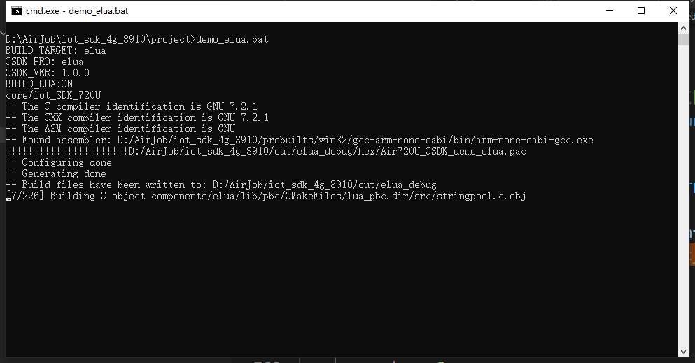

&emsp;&emsp;。。。。。。

&emsp;&emsp;好了。编译完成


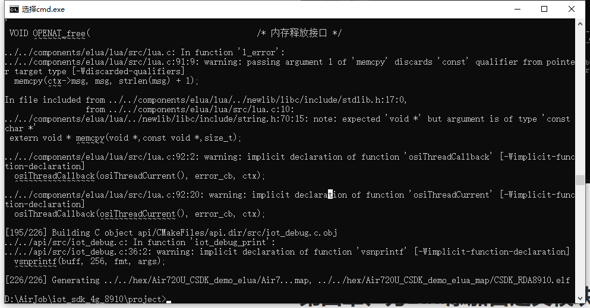

## 3.3、下载固件及脚本
&emsp;&emsp;接下来就和大家使用LUAT版本开发一样了，打开luatools工具。尽量使用高于2.0.68的版本，低版本会出现CSDK日志信息打印不正确的问题。

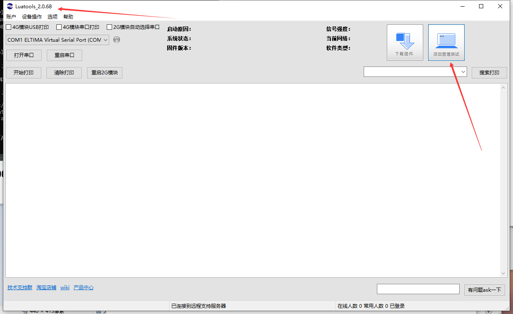

&emsp;&emsp;下载固件和脚本。注意啦，这里选自己编译的固件！！！！在这个地方`~\iot_sdk_4g_8910\hex\Air720U_CSDK_app_elua.pac`，脚本的话就和luat开发脚本一样，通用的没有区别。

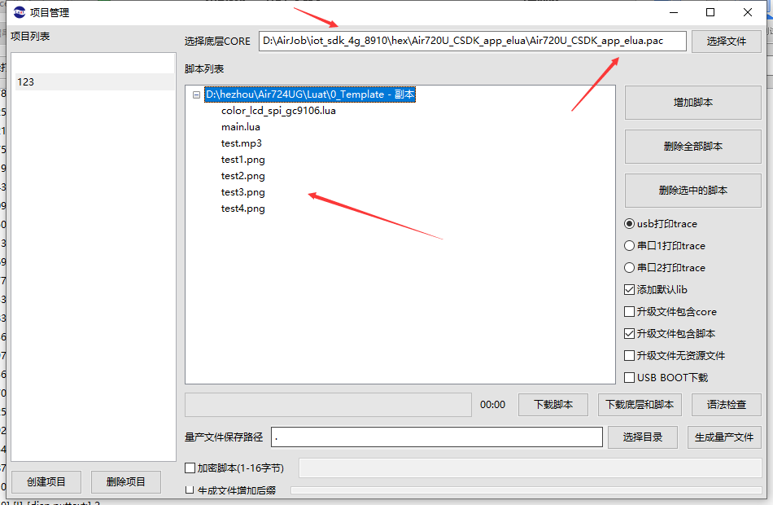


&emsp;&emsp;下载结束就是这个样子了。

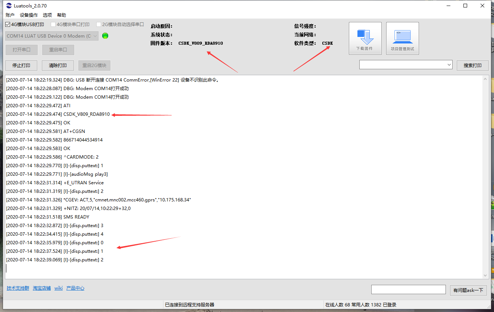

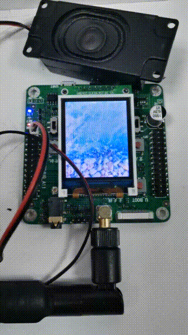


&emsp;&emsp;接下来可以去和其他人吹牛了，我也能编译luat源码了，想让它干什么就让它干什么。自己的模块自己做主！

# 第四章、为eLua添加自定义模块

未完待续。。。。。


